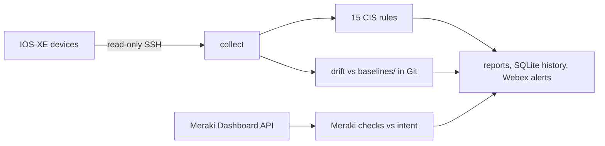
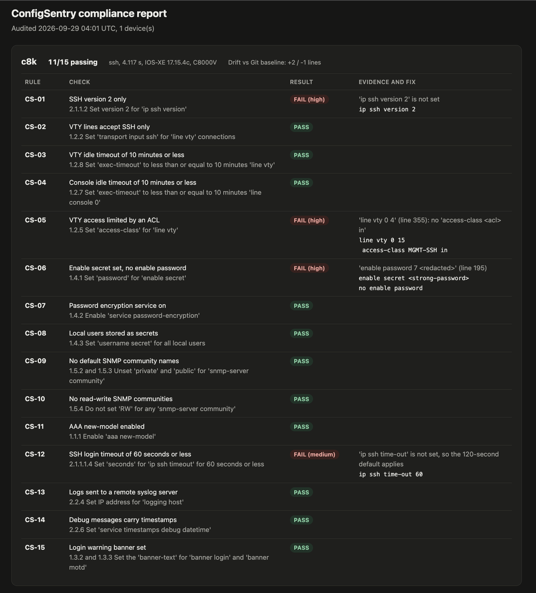
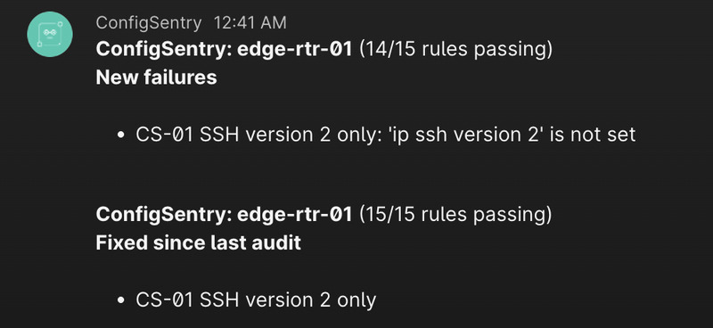

# ConfigSentry

Checks Cisco IOS-XE configs against 15 CIS benchmark rules and Meraki networks against an intent file, and alerts in Webex when something changes.

**Result:** caught 23/23 seeded misconfigurations with 0 false positives, and cut a 15-rule audit from about 5 minutes by hand to under 4 seconds per device.

**Stack:** Python, Netmiko, TextFSM, Meraki Dashboard API, SQLite, pytest, GitHub Actions

[](https://github.com/mumer-net/configsentry/actions/workflows/ci.yml)


## Why I built this

This summer I interned at Cisco on a Catalyst 9350 rollout in Meraki mode. Part of my work was verifying new switches by hand after deployment: stack order, ports, and access point counts. ConfigSentry runs similar checks through the Meraki Dashboard API, and it also audits IOS-XE configs over SSH against 15 CIS benchmark rules.

## Results

| What | Result | How it's measured |
| --- | --- | --- |
| Seeded misconfigurations caught | 23/23, 0 false positives | `configsentry selftest`, run in CI on every push |
| Manual 15-rule audit | 5:07 per device, median of 3 | Stopwatch, logged in [docs/manual-timing.md](docs/manual-timing.md) |
| ConfigSentry audit, SSH included | 3.83 s per device, median of 10 | `configsentry timing`, raw times in [results/timing-c8k.json](results/timing-c8k.json) |
| Meraki sandbox audit | 3 of 5 checks passing: all 4 virtual devices report dormant and the intended uplink port is disconnected | `configsentry meraki`, responses recorded in [tests/fixtures/meraki/sandbox](tests/fixtures/meraki/sandbox) |
| Tested against | Cisco DevNet Catalyst 8000 Always-On sandbox and a DevNet Meraki sandbox org | Read-only SSH and the Dashboard API |

## How it works



| Rule | Check | CIS Cisco IOS XE 17.x v2.1.0 |
| --- | --- | --- |
| CS-01 | SSH version 2 only | 2.1.1.2 |
| CS-02 | VTY lines accept SSH only | 1.2.2 |
| CS-03 | VTY idle timeout of 10 minutes or less | 1.2.8 |
| CS-04 | Console idle timeout of 10 minutes or less | 1.2.7 |
| CS-05 | VTY access limited by an ACL | 1.2.5 |
| CS-06 | Enable secret set, no enable password | 1.4.1 |
| CS-07 | Password encryption service on | 1.4.2 |
| CS-08 | Local users stored as secrets | 1.4.3 |
| CS-09 | No default SNMP community names | 1.5.2, 1.5.3 |
| CS-10 | No read-write SNMP communities | 1.5.4 |
| CS-11 | AAA new-model enabled | 1.1.1 |
| CS-12 | SSH login timeout of 60 seconds or less | 2.1.1.1.4 |
| CS-13 | Logs sent to a remote syslog server | 2.2.4 |
| CS-14 | Debug messages carry timestamps | 2.2.6 |
| CS-15 | Login warning banner set | 1.3.2, 1.3.3 |

CIS numbers follow [Tenable's published audit of the benchmark](https://www.tenable.com/audits/CIS_Cisco_IOS_XE_17.x_v2.1.0_L1).

The Meraki checks compare the Dashboard API with `intent/meraki.yaml`: stack members, the active stack member, uplink ports, access point count, and device status. My sandbox network has one switch and no stack, so the two stack checks have nothing to compare there; the test fixtures cover them with a three-switch stack.

Each audit writes an HTML report and a JSON file to `reports/`:



A few design choices:

- It's read-only. Every command goes through an allowlist of two `show` commands, and a test fails the build if any code enters configuration mode.
- Secrets stay out of reports, alerts, and Git. Reports show `<redacted>`, and baselines store keyed HMAC fingerprints, so a changed password still shows up as drift without the password or its hash being committed.
- `show running-config` hides defaults, so each rule decides what a missing line means. A missing `exec-timeout` is the compliant 10-minute default; a missing `ip ssh time-out` is the 120-second default, which fails.
- Alerts fire on change. A rule that fails on every run alerts once when it starts failing and once when it's fixed.
- Every rule has at least one seeded fault, and the self-test checks that each fault trips its own rule and no other.

When a rule starts failing or gets fixed, the Webex space gets a message:



## How to run

```bash
git clone https://github.com/mumer-net/configsentry && cd configsentry
uv sync
uv run configsentry selftest                                  # seeded-fault table
uv run configsentry audit --file tests/fixtures/golden.cfg    # offline audit, writes reports/latest.html
cp .env.example .env                                          # add DevNet sandbox credentials
uv run configsentry audit --device c8k                        # live audit over SSH
uv run configsentry meraki                                    # Meraki checks against intent/meraki.yaml
uv run configsentry history                                   # past audits from SQLite
```

## Method

- Detection: tests/fixtures/faults.yaml holds 23 seeded faults, each one edit to a compliant config. `configsentry selftest` applies each fault and checks that its rule fails and no other rule does. CI runs it on every push and puts the table in the job summary.
- Manual time: I timed three audits by hand with the checklist in docs/manual-checklist.md, each on a different target, starting the stopwatch after login. The table, the median, and the rules I got wrong are in docs/manual-timing.md.
- Tool time: `configsentry timing --device c8k --runs 10` starts the clock before SSH login, so it includes connecting and pulling the config. The raw times are in results/timing-c8k.json.

## Tests

90 pytest tests run in GitHub Actions on every push. They cover config parsing (including banners), secret redaction, all 15 rules, the seeded-fault self-test, read-only enforcement, drift, the CLI, the Meraki checks with seeded API faults, and SQLite history and alerts. Lint is ruff with the bandit security rules turned on.

## What I'd do next

- Collect configs over NETCONF or RESTCONF instead of parsing CLI output.
- Check CS-01 with `show ip ssh` as well. The Cat8K runs IOS-XE 17.15 and its config has no `ip ssh version 2` line, and I haven't confirmed yet whether that release still allows SSH version 1.
- Add CIS Level 2 rules and per-rule exceptions with expiry dates.
- Retry Webex alerts that fail to send. Right now a failed alert is logged and dropped.
- At a larger scale, move these rules into Nautobot Golden Config and run Batfish before changes.

## Build notes

- Goal: automate the post-deployment checks I used to do by hand, and measure the time saved.
- Built in two releases: v0.1 (IOS-XE rules, self-test, drift, CI), v0.2 (Meraki checks, SQLite history, Webex alerts).
- Ran it against the DevNet Catalyst 8000 Always-On sandbox over SSH. The first audit failed 5 of 15 rules, including no ACL on the VTY lines and a reversible `enable password`.
- The shared sandbox changed under me. A few hours after I saved the baseline, an audit showed drift of +2 / -1 lines: the enable secret had changed and a new privilege-15 local user had appeared. The HMAC fingerprints showed the secret changed without exposing it.
- The sandbox rejected valid credentials twice. Both times the password matched the portal, and ending the reservation and launching a new one fixed it.
- The Meraki sandbox was different from what I planned for: a reservable, dedicated org instead of a shared read-only one, with one switch, one access point, an appliance, and a camera, and no switch stack. I wrote the intent file from `configsentry meraki --discover` and the recorded responses, not from guesses. All four devices report `dormant`, so MK-05 fails on real data.
- The Catalyst 9000 Always-On sandbox never came up for me. Port 22 accepted the TCP connection and then reset before the SSH banner, and a RESTCONF request returned 502 from Cisco's gateway, so I only claim the Cat8K.
- Timing myself by hand showed why the rules are code: in my first trials I missed rules where a missing line means fail, and I read fake config inside a banner as real.

## License

MIT
